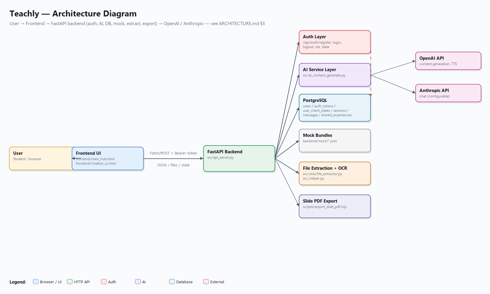
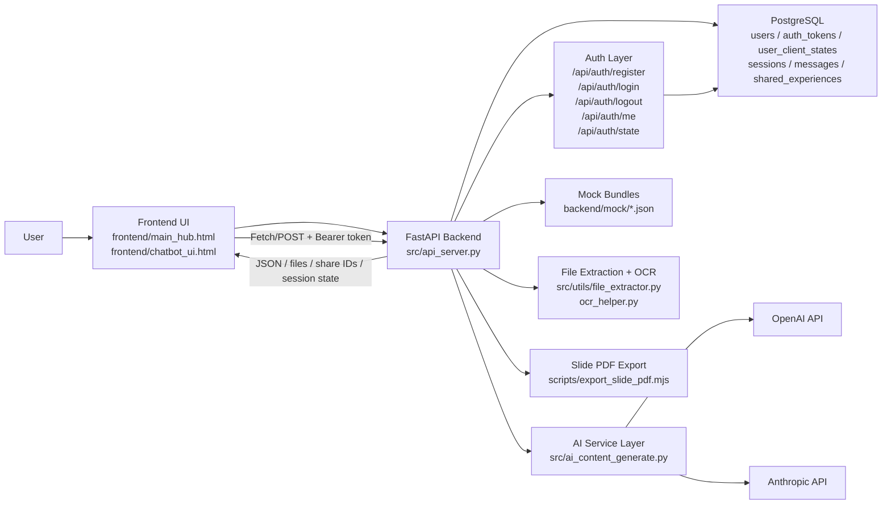
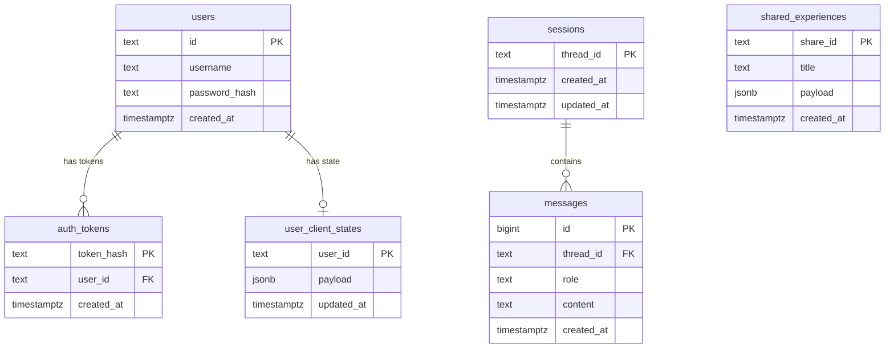

# Kiến trúc Teachly

Tài liệu này mô tả kiến trúc hiện tại của Teachly dựa trên code trong repository này.

## 1. Tổng quan hệ thống

Teachly là một nền tảng học tiếng Anh web-based dành cho học sinh THPT. Ứng dụng phục vụ một static frontend và một JSON API từ cùng một FastAPI backend. Backend xử lý sinh nội dung bằng AI, trích xuất nội dung từ file, lưu trạng thái session, chia sẻ trải nghiệm, và xuất slide.

Phong cách kiến trúc hiện tại:

- Một web application duy nhất
- Static frontend + API backend
- Lưu trữ trên PostgreSQL cho tài khoản người dùng, auth token, trạng thái session, tin nhắn chat, và shared experience
- Khôi phục session theo từng tài khoản khi đăng nhập
- Điều phối AI/LLM ngay trong các backend service
- Gọi đến các provider bên ngoài là OpenAI và Anthropic

## 2. Các thành phần chính

### Người dùng

- Mở landing page và chat UI trong trình duyệt
- Chọn chế độ học: `slide`, `quiz`, `flashcard`, `full set`
- Nhập chủ đề (topic) hoặc upload một tài liệu học
- Xem nội dung được sinh ra, tiếp tục luồng học, chia sẻ trải nghiệm, hoặc xuất slide

### Frontend

Vị trí chính:

- `frontend/`
- `frontend/js/chatbot/`

Trách nhiệm:

- Render landing page và chat/product UI
- Quản lý guided flow và trạng thái form
- Gọi các backend API cho sinh nội dung, upload, chat, dịch, gợi ý và xuất file
- Hiển thị trải nghiệm quiz/flashcard/slide/full-set
- Xử lý đăng ký, đăng nhập và đăng xuất qua auth dialog
- Lưu auth token và user profile trong `localStorage`; kiểm tra hợp lệ khi load app qua `/api/auth/me`
- Khôi phục lịch sử chat session theo từng tài khoản từ server khi đăng nhập qua `/api/auth/state`
- Duy trì trạng thái nhẹ phía browser như số lần play và preference UI

Các vùng frontend chính:

- `controllers/`: điều phối app
- `services/`: API client, history, recommendation, experience, auth service
- `dom/`: render view cho card, chat, quiz, flashcard, slide, auth dialog
- `slide/`: slide shell và helper cho visual editor

### Backend/API

Vị trí chính:

- `src/api_server.py`

Trách nhiệm:

- Phục vụ static frontend file
- Expose toàn bộ REST API endpoint
- Validate request bằng Pydantic
- Xử lý đăng ký, đăng nhập, đăng xuất và xác thực token (`/api/auth/*`)
- Lưu và khôi phục trạng thái client session theo từng tài khoản (`/api/auth/state`)
- Điều phối request sinh nội dung đến AI service
- Áp dụng upload safety và chat scope policy
- Đọc mock content khi cần
- Lưu sessions/messages/shared experiences trong PostgreSQL
- Xuất slide HTML thành PDF thông qua một script Node

### Database

Vị trí chính:

- `src/database.py`

Công nghệ:

- PostgreSQL
- `psycopg2` threaded connection pool

Các bảng hiện tại:

- `users`
- `auth_tokens`
- `user_client_states`
- `sessions`
- `messages`
- `shared_experiences`

Dữ liệu được lưu:

- Tài khoản người dùng: username và password hash dạng PBKDF2-SHA256 (120k iterations, salt ngẫu nhiên cho mỗi user)
- Bearer auth token (lưu dạng SHA-256 hash, liên kết với user)
- Trạng thái client session của từng user (danh sách session đang hoạt động và active index) lưu dạng JSONB
- Định danh chat thread
- Tin nhắn chat và timestamp
- Payload của shared experience lưu dạng JSONB

### Lớp AI / LLM

Vị trí chính:

- `src/ai_content_generate.py`

Trách nhiệm:

- Sinh nội dung `slide`, `quiz`, `flashcard` và `full set`
- Sinh gợi ý autofill cho form
- Sinh nội dung từ text đã trích xuất từ tài liệu upload
- Review và chuẩn hoá output AI cho quiz
- Dịch từ vựng flashcard và sinh phát âm (pronunciation)
- Gợi ý chủ đề học tiếp theo

Provider:

- OpenAI
- Anthropic

Ghi chú quan trọng:

- Ứng dụng hiện tại **không** chạy một agent service dài hạn, tự trị riêng biệt.
- Hành vi AI được điều phối dưới dạng các function call trong backend, được kích hoạt qua HTTP request.
- Một số file scaffold cũ như `src/agent.py` vẫn còn tồn tại, nhưng kiến trúc web đang chạy thực sự xoay quanh `src/api_server.py`.

## 3. Sơ đồ kiến trúc tổng quát

> Ảnh trên được render từ mã Mermaid bên dưới — chạy `venv\Scripts\python.exe screenshots\_raw\render.py` để tái tạo `screenshots/01-architecture-diagram.png`.

## 4. Các luồng dữ liệu chính

### Flow A: Sinh nội dung AI từ chủ đề

1. Người dùng chọn loại nội dung ở frontend.
2. Frontend gửi `POST /api/ai-generate`.
3. Backend validate request và các ràng buộc an toàn.
4. `src/ai_content_generate.py` build prompt và gọi model.
5. Backend chuẩn hoá output JSON.
6. Frontend render trải nghiệm slide, quiz, flashcard hoặc full-set.

### Flow B: Upload file để sinh nội dung học

1. Người dùng upload file `PDF`, `DOCX`, `MD` hoặc `TXT`.
2. Frontend gửi multipart request đến `POST /api/file-upload`.
3. Backend trích xuất text từ file.
4. Upload safety check chạy trên nội dung đã trích xuất.
5. AI generation service tạo nội dung từ ngữ cảnh tài liệu.
6. Frontend render trải nghiệm học đã sinh ra.

### Flow C: Lưu trữ chat session

1. Người dùng gửi tin nhắn từ chat UI.
2. Frontend gửi `POST /api/chat`.
3. Backend lưu tin nhắn của người dùng vào PostgreSQL.
4. Chat scope policy được đánh giá.
5. Backend gọi LLM provider đã cấu hình.
6. Phản hồi của assistant được lưu vào PostgreSQL.
7. Frontend nhận và hiển thị phản hồi.
8. Danh sách session và tin nhắn trong session có thể được mở lại sau từ DB.

### Flow D: Chia sẻ trải nghiệm

1. Người dùng chọn chia sẻ một experience hiện có.
2. Frontend gửi `POST /api/shared-experiences`.
3. Backend lưu trạng thái experience dưới dạng JSONB.
4. Backend trả về `share_id`.
5. Trạng thái đã chia sẻ có thể được load lại qua `GET /api/shared-experiences/{share_id}`.

### Flow E: Xuất slide PDF

1. Frontend gửi `srcdoc` của slide đến `POST /api/slides/export-pdf`.
2. Backend ghi một file payload tạm.
3. Backend gọi script Node.js `scripts/export_slide_pdf.mjs`.
4. Script render/export slide thành PDF.
5. Backend trả về file PDF cho frontend.

### Flow F: Đăng ký và đăng nhập người dùng

1. Người dùng click vào một content card khi chưa đăng nhập.
2. Frontend hiển thị auth dialog (popup login/register).
3. Khi register: frontend gửi `POST /api/auth/register`; backend hash password và lưu user vào bảng `users`.
4. Khi login: frontend gửi `POST /api/auth/login`; backend xác thực PBKDF2-SHA256 hash, sinh một Bearer token ngẫu nhiên, lưu SHA-256 hash của token vào `auth_tokens`, và trả token về.
5. Frontend lưu token và user profile vào `localStorage` qua `authStore.js`.
6. Khi auth state thay đổi, tất cả listener `subscribeAuth` ở frontend được kích hoạt.
7. Frontend gọi `GET /api/auth/state` để load danh sách session đã lưu của user từ `user_client_states`.
8. Lịch sử session được khôi phục và render; sau đó người dùng có thể thao tác bình thường.
9. Khi logout: frontend gọi `POST /api/auth/logout`; backend xoá token hash khỏi `auth_tokens`; frontend xoá `localStorage` sau khi đã lưu trạng thái session hiện tại.

### Flow G: Lưu trữ session theo từng tài khoản

1. Khi người dùng đang đăng nhập, mọi thay đổi đối với danh sách session hoặc active session sẽ kích hoạt một `PUT /api/auth/state` có debounce.
2. Backend upsert toàn bộ JSON trạng thái session vào `user_client_states` cho user hiện tại.
3. Ở lần đăng nhập tiếp theo (trên thiết bị/session bất kỳ), `GET /api/auth/state` trả về trạng thái đã lưu và frontend khôi phục đúng danh sách session cùng active session index.

## 5. Chi tiết các module backend

### `src/api_server.py`

- Entrypoint chính của ứng dụng
- Đăng ký route
- Mount static file
- Các endpoint health và status
- Các endpoint auth: `/api/auth/register`, `/api/auth/login`, `/api/auth/logout`, `/api/auth/me`, `/api/auth/state` (GET + PUT)
- Các endpoint cho chat, sinh nội dung, upload, chia sẻ và export

### `src/ai_content_generate.py`

- Prompt template
- Gọi AI provider
- Chuẩn hoá nội dung
- Điều phối full-set
- Sinh nội dung từ ngữ cảnh file
- Logic gợi ý chủ đề

### `src/database.py`

- Quản lý connection pool
- Khởi tạo schema
- CRUD cho session/message
- Lưu trữ shared experience

### `src/utils/`

- `file_extractor.py`: trích xuất file thành text
- `ocr_helper.py`: đường dẫn helper cho OCR
- `upload_safety.py`: rule an toàn cho prompt/nội dung
- `node_runtime.py`: phân giải Node runtime cho việc export

## 6. Cấu trúc frontend

Runtime frontend chính:

- `frontend/chatbot_ui.html`
- `frontend/js/chatbot/main.js`

Phong cách kiến trúc frontend:

- Vanilla JS module
- Tách thành controller-service-view
- Renderer riêng cho từng chế độ học (experience)

Ví dụ:

- `controllers/messageController.js`: điều phối luồng tin nhắn
- `controllers/experienceController.js`: điều phối experience
- `services/aiContentApi.js`: API client cho sinh nội dung AI và upload
- `services/experienceStateService.js`: xử lý trạng thái experience
- `dom/slideExperienceView.js`: render slide
- `dom/quizExperienceView.js`: render quiz
- `dom/flashExperienceView.js`: render flashcard

## 7. Mô hình database

## 8. Các phụ thuộc bên ngoài

- OpenAI API cho sinh nội dung, dịch flashcard và hỗ trợ phát âm
- Anthropic API cho chế độ chat khi được cấu hình
- PostgreSQL database
- Node.js runtime cho việc xuất slide PDF

## 9. Ghi chú triển khai

- Runtime local có thể được khởi động bằng Uvicorn.
- Docker được cung cấp để container hoá ứng dụng.
- `docker-compose.yml` không kèm sẵn một database service, nên PostgreSQL phải được cung cấp riêng.
- Frontend và backend được phục vụ từ cùng một application host trong cấu hình mặc định.

## 10. Ranh giới kiến trúc hiện tại

Những gì hệ thống hiện có:

- Static frontend
- REST backend
- Session lưu trong database
- Điều phối AI service
- Luồng tài liệu-thành-nội-dung-học (document-to-learning-content)

Những gì hệ thống chưa có như một thành phần kiến trúc first-class:

- Vector database chuyên dụng
- Event bus hoặc async job queue
- Microservice tách biệt
- Runtime multi-agent tự trị, dài hạn
