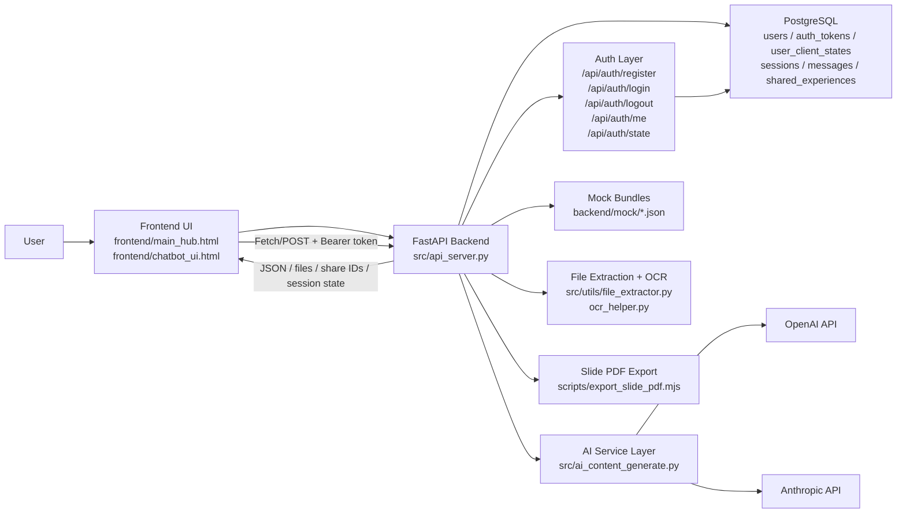
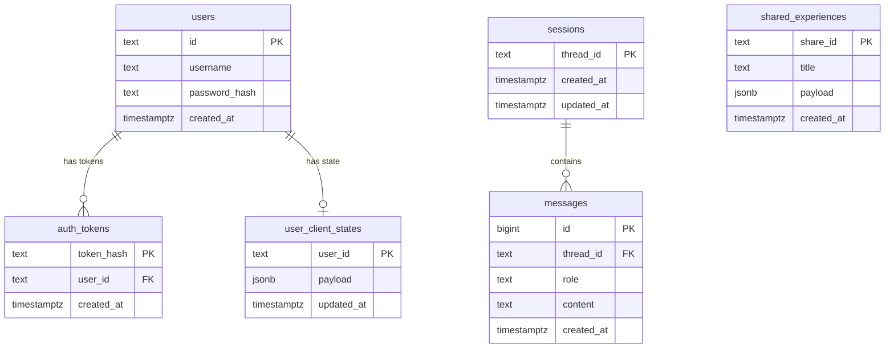

# Teachly Architecture

This document describes the current architecture of Teachly based on the code in this repository.

## 1. System Overview

Teachly is a web-based English-learning platform for THPT students. The application serves a static frontend and a JSON API from the same FastAPI backend. The backend handles AI-powered content generation, file-based content extraction, session persistence, experience sharing, and slide export.

Current architecture style:

- Single web application
- Static frontend + API backend
- PostgreSQL persistence for user accounts, auth tokens, session state, chat messages, and shared experiences
- Per-account session restoration on login
- AI/LLM orchestration inside backend services
- External provider calls to OpenAI and Anthropic

## 2. Main Components

### User

- Opens the landing page and chat UI in the browser
- Chooses learning mode: `slide`, `quiz`, `flashcard`, `full set`
- Enters topic text or uploads a study document
- Reviews generated content, continues the learning flow, shares experiences, or exports slides

### Frontend

Main location:

- `frontend/`
- `frontend/js/chatbot/`

Responsibilities:

- Render landing page and chat/product UI
- Manage guided flow and form states
- Call backend APIs for generation, upload, chat, translation, recommendations, and export
- Display quiz/flashcard/slide/full-set experiences
- Handle user registration, login, and logout via auth dialog
- Persist auth token and user profile in localStorage; validate on app load via `/api/auth/me`
- Restore per-account chat session history from server on login via `/api/auth/state`
- Maintain lightweight browser-side state such as play counts and UI preferences

Key frontend areas:

- `controllers/`: app orchestration
- `services/`: API clients, history, recommendation, experience, auth services
- `dom/`: view rendering for cards, chat, quiz, flashcards, slides, auth dialog
- `slide/`: slide shell and visual editor helpers

### Backend/API

Main location:

- `src/api_server.py`

Responsibilities:

- Serve static frontend files
- Expose all REST API endpoints
- Validate requests with Pydantic
- Handle user registration, login, logout, and token validation (`/api/auth/*`)
- Persist and restore per-account client session state (`/api/auth/state`)
- Route generation requests to AI services
- Enforce upload safety and chat scope policy
- Read mock content when needed
- Persist sessions/messages/shared experiences in PostgreSQL
- Export slide HTML into PDF through a Node-based script

### Database

Main location:

- `src/database.py`

Technology:

- PostgreSQL
- `psycopg2` threaded connection pool

Current tables:

- `users`
- `auth_tokens`
- `user_client_states`
- `sessions`
- `messages`
- `shared_experiences`

Stored data:

- User accounts: username and bcrypt password hash
- Bearer auth tokens (stored as SHA-256 hash, linked to user)
- Per-user client session state (active session list and active index) as JSONB
- Chat thread identifiers
- Chat messages and timestamps
- Shared experience payloads as JSONB

### AI / LLM Layer

Main location:

- `src/ai_content_generate.py`

Responsibilities:

- Generate `slide`, `quiz`, `flashcard`, and `full set` content
- Generate autofill suggestions for forms
- Generate content from uploaded document text
- Review and normalize AI quiz output
- Translate flashcard vocabulary and generate pronunciations
- Recommend next learning topics

Providers:

- OpenAI
- Anthropic

Important note:

- The current application does **not** run a separate autonomous long-lived agent service.
- AI behavior is orchestrated as backend function calls triggered by HTTP requests.
- Legacy scaffold files such as `src/agent.py` exist, but the live web architecture is centered on `src/api_server.py`.

## 3. High-Level Architecture Diagram

## 4. Main Data Flows

### Flow A: Topic-based AI generation

1. User selects a content type in the frontend.
2. Frontend sends `POST /api/ai-generate`.
3. Backend validates request and safety constraints.
4. `src/ai_content_generate.py` builds prompts and calls the model.
5. Backend normalizes output JSON.
6. Frontend renders slide, quiz, flashcard, or full-set experience.

### Flow B: File upload to generated learning content

1. User uploads `PDF`, `DOCX`, `MD`, or `TXT`.
2. Frontend sends multipart request to `POST /api/file-upload`.
3. Backend extracts text from the file.
4. Upload safety checks run on extracted content.
5. AI generation service creates content from document context.
6. Frontend renders the generated learning experience.

### Flow C: Chat session persistence

1. User sends a message from the chat UI.
2. Frontend sends `POST /api/chat`.
3. Backend stores the user message in PostgreSQL.
4. Chat scope policy is evaluated.
5. Backend calls the configured LLM provider.
6. Assistant reply is stored in PostgreSQL.
7. Frontend receives and displays the response.
8. Session list and session messages can later be reopened from DB.

### Flow D: Share experience

1. User chooses to share an existing experience.
2. Frontend sends `POST /api/shared-experiences`.
3. Backend stores the experience state as JSONB.
4. Backend returns a `share_id`.
5. Shared state can later be loaded through `GET /api/shared-experiences/{share_id}`.

### Flow E: Slide PDF export

1. Frontend sends slide `srcdoc` to `POST /api/slides/export-pdf`.
2. Backend writes a temporary payload file.
3. Backend invokes Node.js script `scripts/export_slide_pdf.mjs`.
4. Script renders/export slides to PDF.
5. Backend returns the generated PDF file to the frontend.

### Flow F: User registration and login

1. User clicks a content card while unauthenticated.
2. Frontend shows the auth dialog (login/register popup).
3. On register: frontend sends `POST /api/auth/register`; backend hashes password and stores user in `users`.
4. On login: frontend sends `POST /api/auth/login`; backend verifies password hash, generates a random Bearer token, stores its SHA-256 hash in `auth_tokens`, and returns the token.
5. Frontend saves the token and user profile to `localStorage` via `authStore.js`.
6. Auth state change fires all `subscribeAuth` listeners in the frontend.
7. Frontend calls `GET /api/auth/state` to load the user's saved session list from `user_client_states`.
8. Session history is restored and rendered; user can then interact normally.
9. On logout: frontend calls `POST /api/auth/logout`; backend deletes the token hash from `auth_tokens`; frontend clears `localStorage` before saving current session state.

### Flow G: Per-account session persistence

1. While the user is logged in, any change to the session list or active session triggers a debounced `PUT /api/auth/state`.
2. Backend upserts the full session state JSON into `user_client_states` for the current user.
3. On next login (any device/session), `GET /api/auth/state` returns the saved state and the frontend restores the exact session list and active session index.

## 5. Detailed Backend Modules

### `src/api_server.py`

- Main application entrypoint
- Route registration
- Static file mounting
- Health and status endpoints
- Auth endpoints: `/api/auth/register`, `/api/auth/login`, `/api/auth/logout`, `/api/auth/me`, `/api/auth/state` (GET + PUT)
- Chat, generation, upload, sharing, and export endpoints

### `src/ai_content_generate.py`

- Prompt templates
- AI provider calls
- Content normalization
- Full-set orchestration
- File-context generation
- Recommendation logic

### `src/database.py`

- Connection pool management
- Schema initialization
- Session/message CRUD
- Shared experience persistence

### `src/utils/`

- `file_extractor.py`: file-to-text extraction
- `ocr_helper.py`: OCR helper path
- `upload_safety.py`: prompt/content safety rules
- `node_runtime.py`: Node runtime resolution for export

## 6. Frontend Structure

Main frontend runtime:

- `frontend/chatbot_ui.html`
- `frontend/js/chatbot/main.js`

Frontend architecture style:

- Vanilla JS modules
- Controller-service-view split
- Experience-specific renderers for each learning mode

Examples:

- `controllers/messageController.js`: message flow coordination
- `controllers/experienceController.js`: experience orchestration
- `services/aiContentApi.js`: API client for AI generation and upload
- `services/experienceStateService.js`: experience state handling
- `dom/slideExperienceView.js`: slide rendering
- `dom/quizExperienceView.js`: quiz rendering
- `dom/flashExperienceView.js`: flashcard rendering

## 7. Database Model

## 8. External Dependencies

- OpenAI API for content generation, flash translation, and pronunciation support
- Anthropic API for chat mode when configured
- PostgreSQL database
- Node.js runtime for slide PDF export

## 9. Deployment Notes

- Local runtime can be started with Uvicorn.
- Docker is provided for app containerization.
- `docker-compose.yml` does not bundle a database service, so PostgreSQL must be provided separately.
- Frontend and backend are served from the same application host in the default setup.

## 10. Current Architectural Boundaries

What the current system has:

- Static frontend
- REST backend
- Database-backed sessions
- AI service orchestration
- Document-to-learning-content flow

What the current system does not yet have as a first-class architecture component:

- Dedicated vector database
- Event bus or async job queue
- Separate microservices
- Persistent autonomous multi-agent runtime
